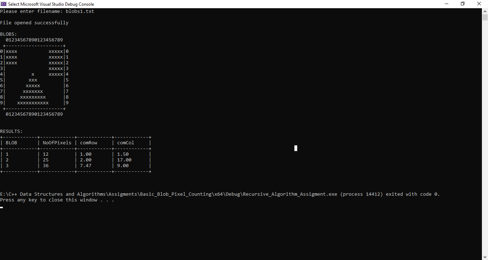
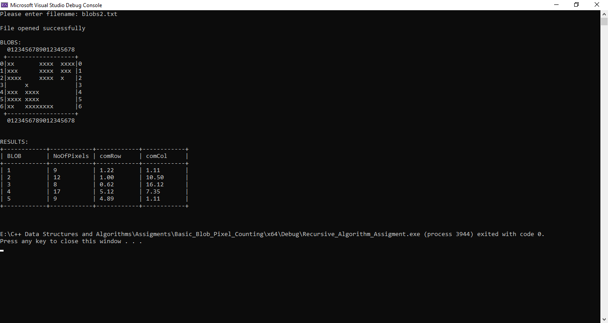
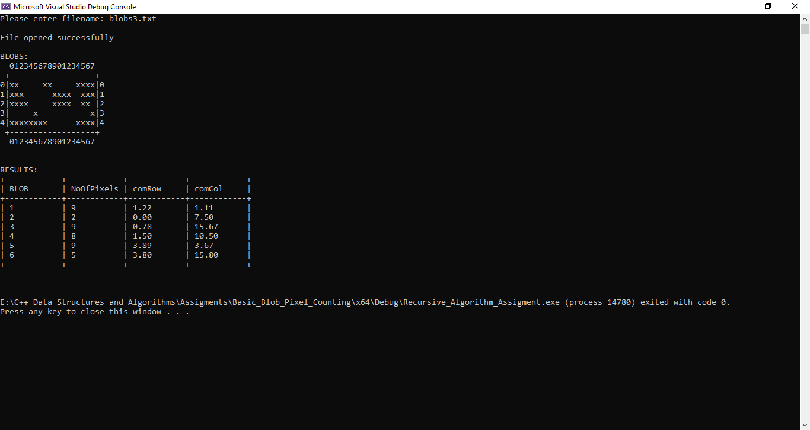

# Basic Blob Finding and Pixel counting Project 

## Prerequisites 

The project runs on C++ Visual Studio Environment. The program can be run in other IDEs as well.
To do that successfully, only the main.cpp is needed. An enlarged console screen is suitable for correct
visualization of the blobs counted and results computed.

## About 

The project is an assignment given to me as part of the requirement of Data Structures and Algorithms
Lab class.

- Operations 
1. The Program reads a .txt file contaning the blobs
2. The blobs are scanned/ searched.
3. When a blob is found, the number of pixels it contains is counted recursively
4. The pixel count is then used compute the number of center of it's mass on the x and y cordinates of the .txt file
5. The results get printed on the console together with the blobs.

For more info please find the question here [`Blob_Pixel_Counting.pdf`](Problem/Blob_Pixel_Counting.pdf)

## Technologies 

C/C++, Visual Studio 

## Contributor(s)

Muhammed Suwaneh

## Disclaimer 

This project is purposely meant for practice. To professionally count pixels, it is
recommended to use libaries like OpenCV & languages like Python. The program cannot 
count pixels of a real picture/image. I hope students find it useful.

## Screenshots

### Blob 1

### Blob 2

### Blob 3

